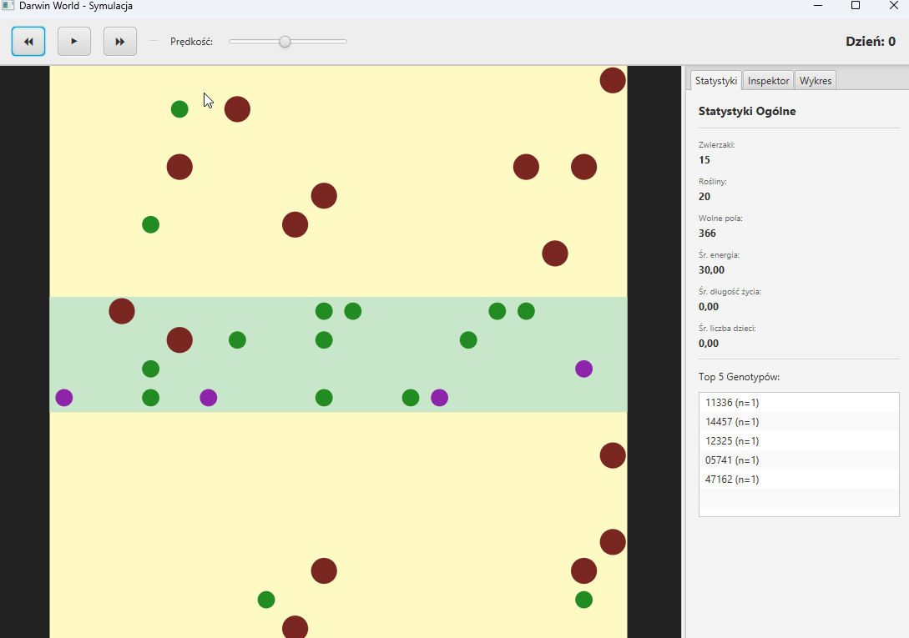

# Darwin World

## Project Description

**Darwin World** is an evolutionary simulation inspired by the concept of the real world, where animals compete for resources, reproduce, and evolve based on their environment and genes. This project was developed as part of the **Object-Oriented Programming 2025** course and includes the implementation of **Variant E: Poisons and Immunity**.

The simulation allows users to observe population dynamics, interactions between organisms, and the impact of environmental factors (e.g., poisons) on survival and evolution.

---



---

## 🌿 Variant E: Poisons and Immunity

### Poison Mechanics
In the **Darwin World** simulation, some plants are **poisonous**. When an animal eats a poisonous plant, instead of gaining energy, it **loses life (energy points)**. This mechanism simulates realistic environmental threats that affect the survival of organisms.

### Genetic Immunity
Animals can possess **genetic immunity to poison**. This immunity is determined by the animal's **genotype**, which is compared to a specific **genetic pattern**.

#### How Does the Immunity Algorithm Work?
1. **Genotype**: Each animal has a unique genotype, represented as a sequence of digits.
2. **Immunity Pattern**: There is a predefined genetic pattern that determines immunity to poison.
3. **Comparison**: When an animal encounters poison, its genotype is compared to the pattern. If the animal's genotype **matches the pattern**, the poison has no effect, and the animal does not lose energy.
4. **Configuration**: Users can configure both the **probability of poisonous plants appearing** and the **immunity pattern** in the application's GUI.

---

## 🐾 Features

| Feature         | Description                                                                 |
|-----------------|-----------------------------------------------------------------------------|
| **🗺️ Map**      | The space where animals move and plants grow. Users can observe real-time interactions. |
| **🏃 Movement**  | Animals move randomly or according to specific rules.                       |
| **👶 Reproduction** | Animals can reproduce, passing their genes to offspring.                   |
| **📊 Statistics** | The application collects data on population, average energy, lifespan, and number of offspring. |

---

## 🚀 How to Run

### Requirements
- Java 17+
- Gradle (optional)

### Steps
1. **Clone the project**:
   ```bash
   git clone https://github.com/SZYMMIX/Darwin-World
   cd Darwin-World
   ```

2. **Build the project**:
   - **Gradle**:
     ```bash
     ./gradlew build
     ```

3. **Run the application**:
   - Execute the JAR file:
     ```bash
     java -jar build/libs/darwin-world.jar
     ```

4. **GUI**:
   - The application will launch with a JavaFX GUI, where you can configure and observe the simulation.

---
## ⚙️ Configuration

Users can customize the following parameters **in the input file** or **via the GUI**:

| Parameter | Description |
| --- | --- |
| Map Width | Width of the simulation map. |
| Map Height | Height of the simulation map. |
| Initial Plant Count | Starting number of plants on the map. |
| Plant Energy | Energy gained by an animal after eating a plant. |
| Daily Plant Growth | Number of new plants that grow on the map each day. |
| Initial Animal Count | Starting number of animals on the map. |
| Initial Animal Energy | Starting energy for each animal. |
| Daily Energy Cost | Energy lost by an animal during each day. |
| Reproduction Energy Minimum | Minimum energy required for an animal to reproduce. |
| Reproduction Energy Cost | Energy lost by an animal after reproduction. |
| Minimum Mutations | Minimum number of genetic mutations during reproduction. |
| Maximum Mutations | Maximum number of genetic mutations during reproduction. |
| Genotype Length | Length of the animal's genotype. |
| Enable Poison Map | Whether poisonous plants should be enabled on the map. |
| Poison Probability | Probability that a plant will be poisonous. |
| Poison Energy Cost | Energy lost by an animal after eating a poisonous plant. |

---

## 🛠️ Project Structure
Cleaned-up view of the source code and main modules:

```text
.
├── darwin
│   ├── src/main/java/agh/ics/oop
│   │   ├── app/                # Application entry point & UI
│   │   │   ├── components/     # UI elements (Charts, Visualizers, Sidebars)
│   │   │   └── ...             # Simulation Engine & Windows
│   │   ├── model/              # Domain models (Animal, Genotype, Plant, Vector2d)
│   │   ├── simulation/         # Core simulation logic (Map, Stats, Interaction Handler)
│   │   └── util/               # Utility classes
│   ├── darwin_config/          # Default configuration files (.cfg)
│   └── build.gradle            # Gradle build script
├── docs/gifs/                  # Project demos and documentation assets
└── README.md
```

---

## 👨‍💻 Authors

| Name               | GitHub                          |
|--------------------|---------------------------------|
| Szymon Cimochowski | [SZYMMIX](https://github.com/SZYMMIX) |
| Marcin Otte        | [marcin-otte](https://github.com/marcin-otte) |

---
